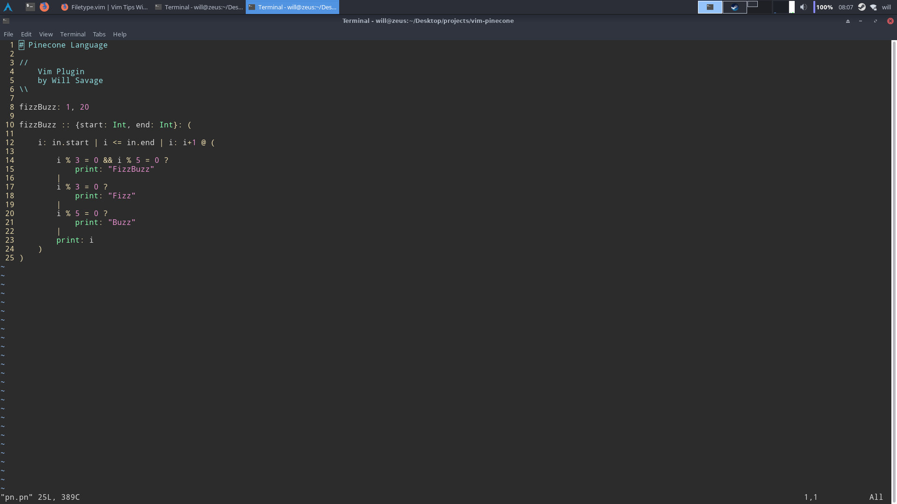

# vim-pinecone
Syntax highlighting in VIM for the pinecone programming language.

# Installation
## Linux
1. Clone this repo to your computer somewhere
2. Navigate into the `vim-pinecone` directory
3. `cp pn.vim ~/.vim/syntax/pn.vim` You may need to create the `~/.vim/syntax`
4. Add the following to your `~/.vim/filetype.vim`:

`if exists("did_load_filetypes")`
  `finish`
`endif`
`augroup filetypedetect`
  
    `au! BufNewFile,BufRead *.vim setf pn`    

`augroup END`

(if you already have a structure like that, just add the `au!` line between `augroup filetypedetect` and `augroup END`)

5. Open up a pinecone file in VIM
6. You're done!
